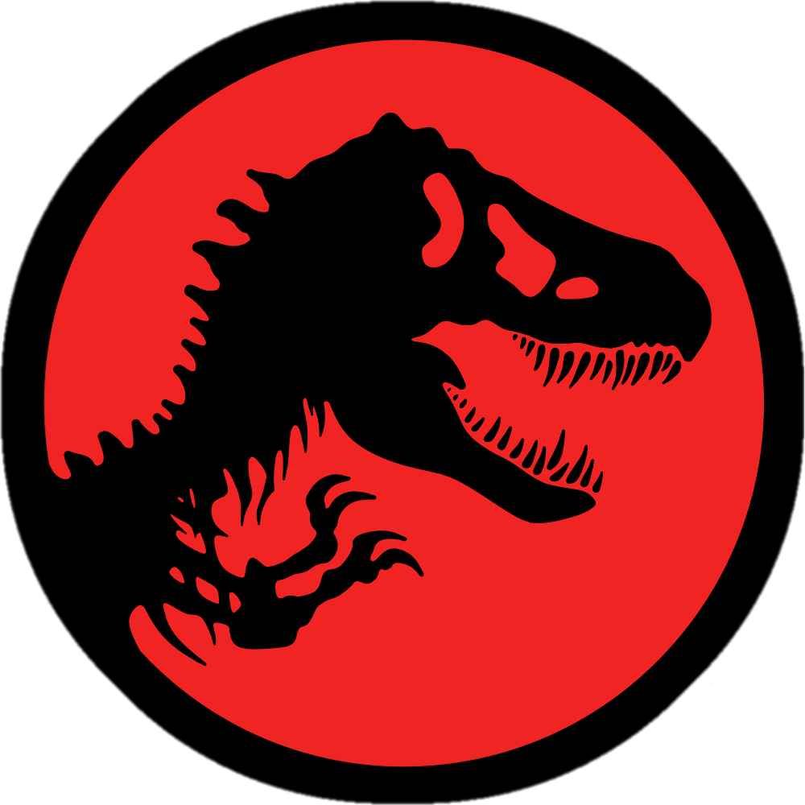

<a name="readme-top">

<br/>

<br />
<div align="center">
  <a href="https://github.com/johann122004/">
  <!-- TODO: If you want to add logo or banner you can add it here -->
    
  </a>
<!-- TODO: Change Title to the name of the title of your Project -->
  <h3 align="center">Hands on 2</h3>
</div>
<!-- TODO: Make a short description -->
<div align="center">
  The project is designed to display different types of designs within each webpage.
</div>

<br />

<!-- TODO: Change the zyx-0314 into your github username  -->
<!-- TODO: Change the WD-Template-Project into the same name of your folder -->


---

<br />
<br />

<!-- TODO: If you want to add more layers for your readme -->
<details>
  <summary>Table of Contents</summary>
  <ol>
    <li>
      <a href="#overview">Overview</a>
      <ol>
        <li>
          <a href="#key-components">Key Components</a>
        </li>
        <li>
          <a href="#technology">Technology</a>
        </li>
        <li>
          <a href="#deployment">Deployment</a>
        </li>
        <li>
          <a href="#guide">Guide</a>
        </li>
      </ol>
    </li>
    <li>
      <a href="#rule,-practices-and-principles">Rules, Practices and Principles</a>
    </li>
    <li>
      <a href="#resources">Resources</a>
    </li>
  </ol>
</details>

---

## Overview

<!-- TODO: To be changed -->
<!-- The following are just sample -->
Description of the project in details.

Guiding Question:
- What is the project
- Whats the purpose
- What are key components
- What technology used and how it is used

Answers:
- What is the project
  - The project is a Hands On project meant to be done during inside the campus of FEUTech.
- Whats the purpose
  - The purpose is to create a website that features hero webpages that has designs that are unique to each other. It will also include a Gallery Website featuring different types of cards that are featured in each hero webpage.
- What are key components
  - The key components of the website are that it is a Multi-Page Website, it features a gallery website for the display of the hero webpage cards, and  the cards that are featured will have static and animated versions.
- What technology used and how it is used
  - The technology that is used are HTML and CSS. HTML is used to create the body of the website such as adding the words and the images, while CSS is used to design the output of the website.
### Key Components
<!-- TODO: List of Key Components -->
<!-- The following are just sample -->
- Multi-Page Website
- Gallery Website
- Static and Animated designs

### Technology
<!-- TODO: List of Technology Used -->


### Deployment
#### The link to the deployed website

- https://johann122004.github.io/WD-Lopez-Hands-On-2/

### Guide
#### How to use this Website?
1. You will start at the main landing page, the website has 6 buttons, each one will take you to a different hero webpage.
2. Each hero webpage has a unique design with 2 cards, one animated, and one that is static.
3. If you are in a webpage other than the landing page, you can go to different webpages through the buttons that can be found at the top of the webpage via header.

## Rules, Practices and Principles
1. Always use `WD-` in the front of the Title of the Project for the Subject followed by your custom naming.
2. Do not rename any .html files; always use `index.html` as the filename.
3. Place Files in their respective folders.
4. All file naming are in camel case.
   - Camel case is naming format where there is no white space in separation of each words, the first word is in all lower case while the succeding words first letter are in upper followed by lower cased letters.
   - ex.: buttonAnimatedStyle.css
5. Use only `External CSS`.
6. Renaming of Pages folder names are a must, and relates to what it is doing or data it holding.
7. File Structure to follow below.

```
WD-ProjectName
└─ assets
|   └─ css
|   |   └─ style.css
|   └─ img
|   |   └─ fileWith.jpeg/.jpg/.webp/.png
|   └─ js
|       └─ script.js
└─ pages
|  └─ pageName
|     └─ assets
|     |  └─ css
|     |  |  └─ style.css
|     |  └─ img
|     |  |  └─ fileWith.jpeg/.jpg/.webp/.png
|     |  └─ js
|     |     └─ script.js
|     └─ index.html
└─ index.html
└─ readme.md
```

## Resources

<!-- TODO: Add References -->
| Title | Purpose | Link |
| CSS Layout - The position Property | For the positioning of the sections| https://www.w3schools.com/css/css_positioning.asp |
| Responsive Web Design - Images | To change the size of the image whenever resizing the website. | https://www.w3schools.com/css/css_rwd_images.asp |
| How to Write Text on Image using HTML and CSS | For additional help in putting the text above the image | https://www.youtube.com/watch?v=Ne-uF4oY6pQ |